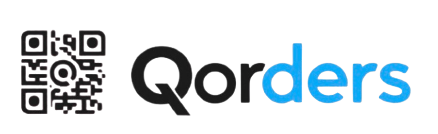

# Introducción

**QoRders** es una plataforma diseñada para digitalizar y optimizar la gestión de restaurantes, con la posibilidad de una ambientación temática.

El Backend está desarrollado con ***Spring Boot*** para los usuarios **Cliente**, y proporciona funcionalidades robustas para manejar reservas, y ***Laravel*** para roles importantes, como **Manager** y **Camarero**, ofreciendo una experiencia fluida y profesional.

El Frontend está desarrollado con ***Vue*** y la parte de donaciones y ONG con ***React***.

---

## 🍽️ Optimización de reservas y pedidos
**QoRders** asegura una experiencia fluida tanto para clientes como para el personal del restaurante:

- **Simplicidad y Agilidad**:
  - Desde la reserva hasta la llegada, todo el proceso está optimizado.
  - Confirmaciones claras y detalladas en tiempo real.
  - Comandas abiertas para cualquier camarero que esté libre para mejorar la velocidad del servicio.

- **Valor Social y Fidelidad**:
  - Contribuimos con un 0,9% de la facturación total a las ONG asociadas.
  - Por cada Euro gastado obtienes automáticamente un punto y cada 100 los puedes canjear por 1€, es decir un 1% de retorno.
  - Por cada 100€ contribuidos con tus pagos en la aplicación se te proporciona a la cuenta un cupón de un 20% aplicable a cualquier pago.

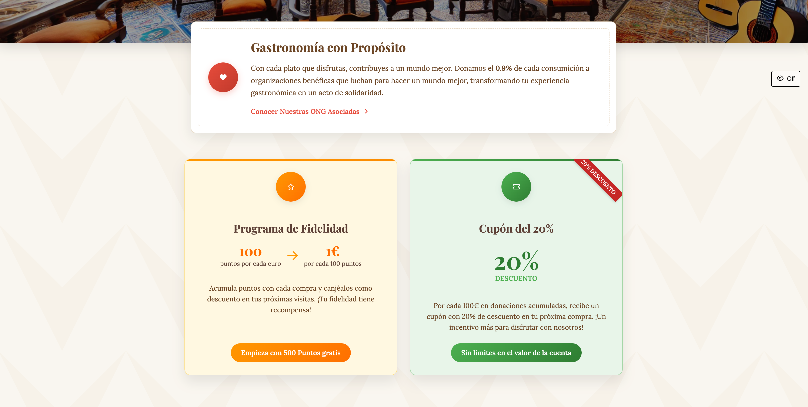

---

### 🍔 Salas y Productos

- **Experiencia Temática**
  - Acceder a salas con comida y ambientanción temática de distintos paises.
  - Los productos son únicos por cada sala temática, desde los entrantes hasta las bebidas.
  - Los colores se cambian con colores de la bandera según el país de la sala a la que accedes.

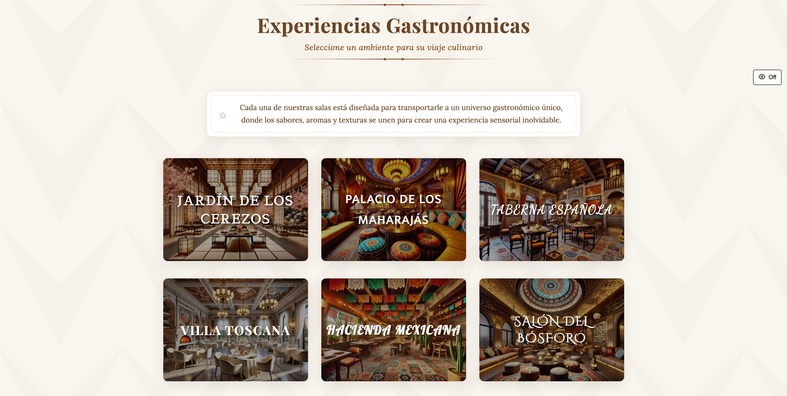

- **Visualización de la carta del restaurante:**
  - Lista de alérgenos para que puedas elegir tu plato preferido sin peligro.
  - También incluye precio, descripción e imagen para una mayor transparencia.
  - Filtrado por precio y tipo de producto.
  - Todos los tipos de usuarios pueden ver la carta.

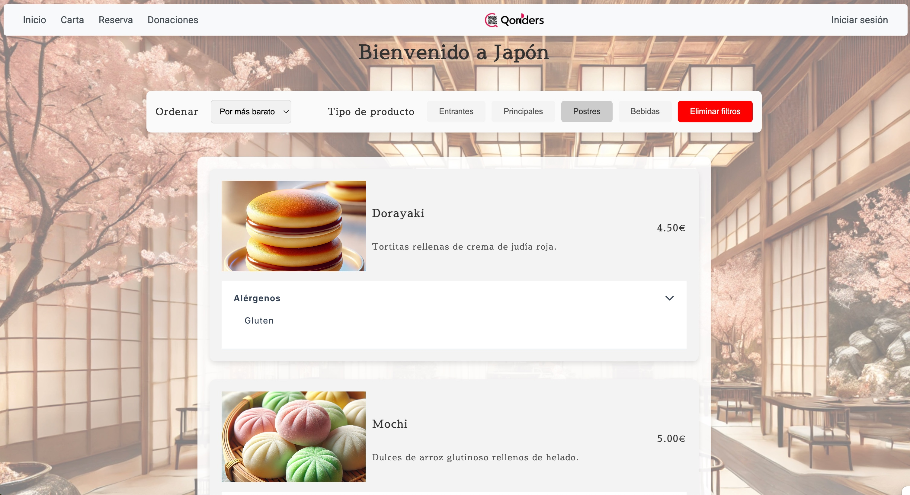

---

### 🔐 Login y Registro
La plataforma permite a los usuarios registrarse y acceder con cualquier tipo de usuario desde el mismo formulario.

- **Registro de Usuarios**:
  - Los usuarios solo pueden registrarse con el tipo de usuario `Cliente` ya que el camarero y manager necesitan permisos de administrador.
  - Se permite el uso del mismo email para diferentes tipos de cuentas ya que se almacenan en tablas distintas.

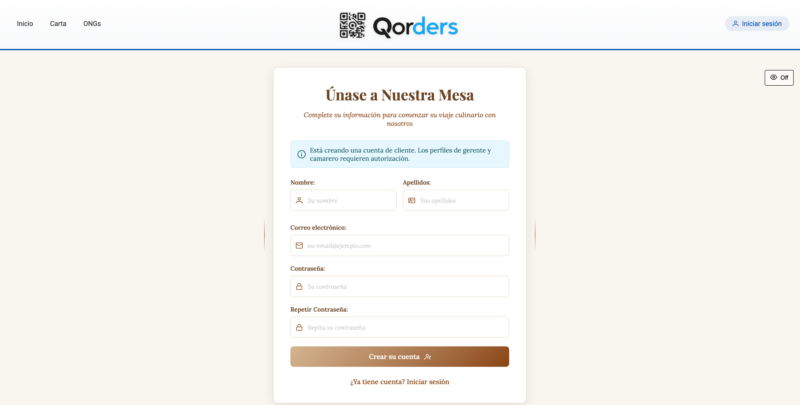

- **Validaciones**:
  - Todos los campos obligatorios deben ser completados.
  - El email debe tener un formato válido.
  - La contraseña debe cumplir con los requisitos de seguridad (mínimo 8 caracteres, al menos una letra mayúscula, una letra minúscula y un número).
  - Confirmación de contraseña para asegurar que ambas coinciden.

- **Login de Usuarios**:
  - Los usuarios pueden iniciar sesión seleccionando el tipo de usuario (Cliente, Camarero, Manager) mediante un radio button.
  - Se verifica el email y la contraseña contra la tabla correspondiente en la base de datos.
  - Los usuarios autenticados reciben un token JWT para acceder a las funcionalidades de la plataforma.

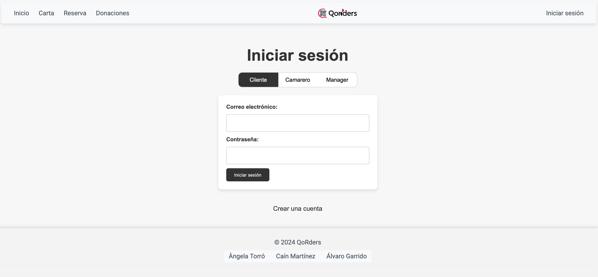

---

### 📅 Gestión de Reservas
La plataforma permite a los clientes realizar reservas de forma sencilla y segura, asegurando una experiencia fluida para el usuario y eficiencia en la gestión operativa.

- **Creación de Reservas**:
  - Los clientes pueden reservar turnos específicos (comida o cena) en salas temáticas.
  - Se verifica automáticamente la disponibilidad y la capacidad antes de confirmar la reserva en el calendario a tiempo real.

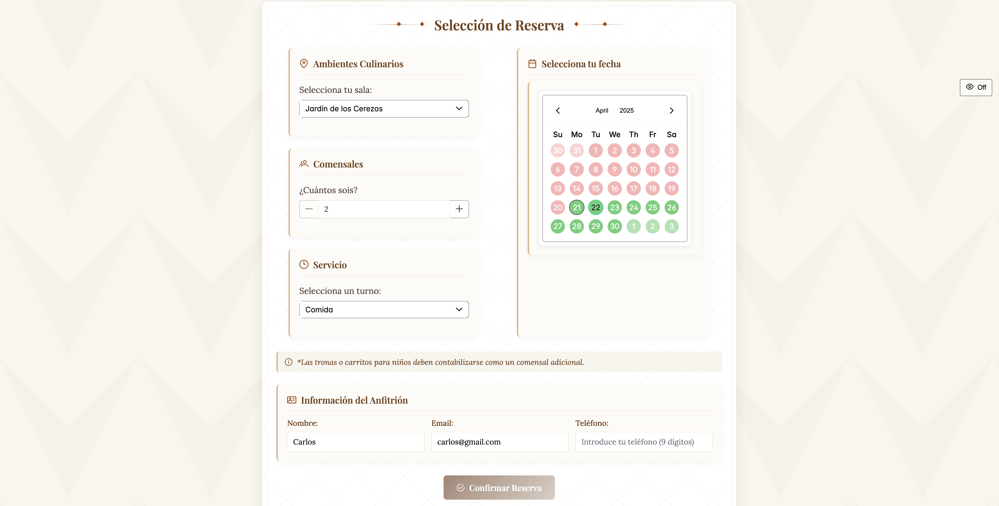

- **Validación y Confirmación**:
  - QoRders asegura que los clientes no puedan duplicar reservas en el mismo día.
  - La confirmación incluye un mensaje de texto enviado al cliente.

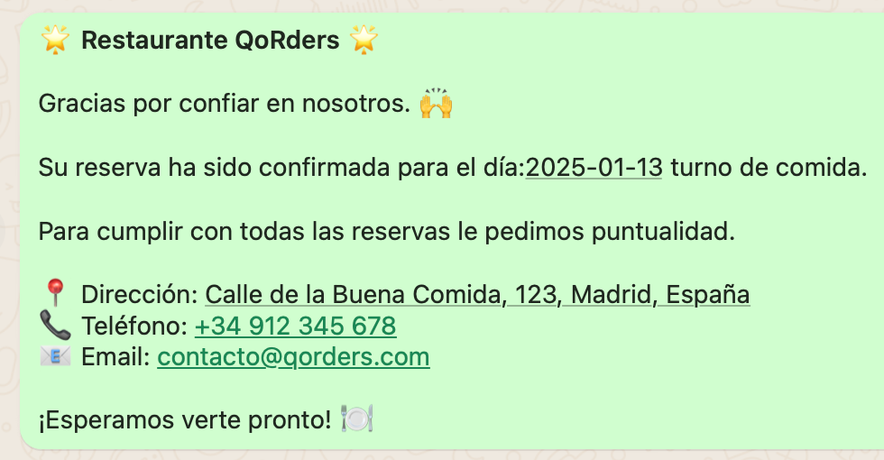

---

### 📱 Generación de Códigos QR
La plataforma utiliza códigos QR para agilizar la experiencia tanto de los clientes como del personal del restaurante.

- **Automatización**:
  - Cada reserva confirmada genera automáticamente un código QR único.
  - Este código es utilizado para identificar y gestionar fácilmente la reserva en el restaurante.

- **Seguimiento y Control**:
  - Los códigos QR tienen diferentes estados (`Generado`, `Impreso`, `En Progreso`, `Expirado`) para evitar duplicidades.

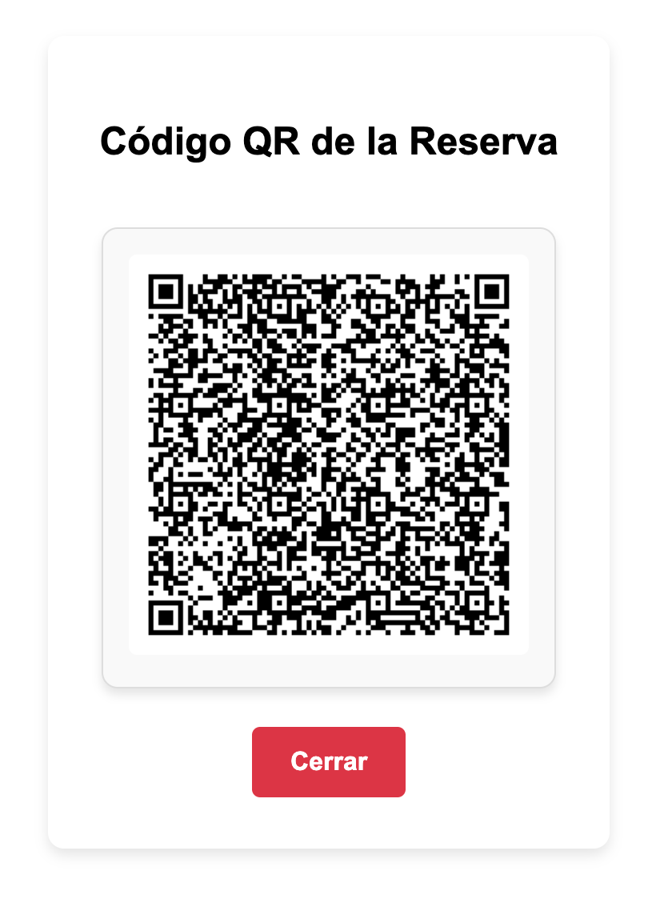

---

### 📊 Perfil inmersivo para Clientes
El perfil permite ver y actiualizar la información además de ver las reservas realizadas pero de una forma un poco característica.

- **Información y métricas**:
  - Visualización de una gráfica de reservas.
  - Métrica y barra de completado para la obtención del bono.
  - Ver y modificar la información personal.

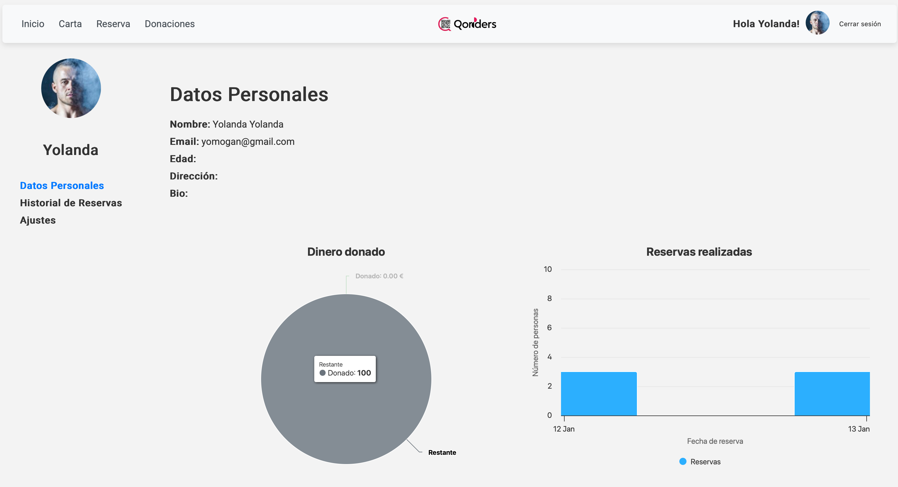
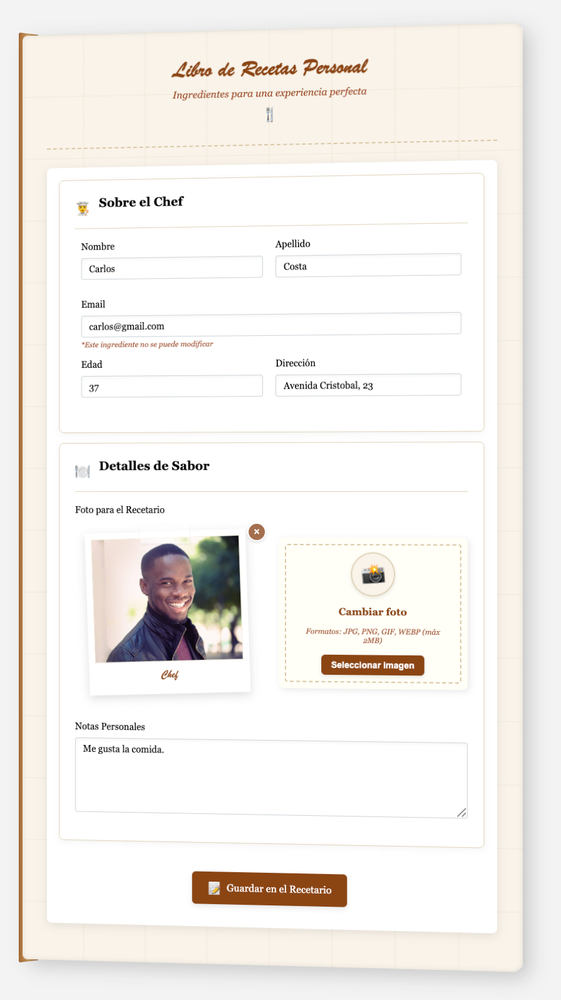
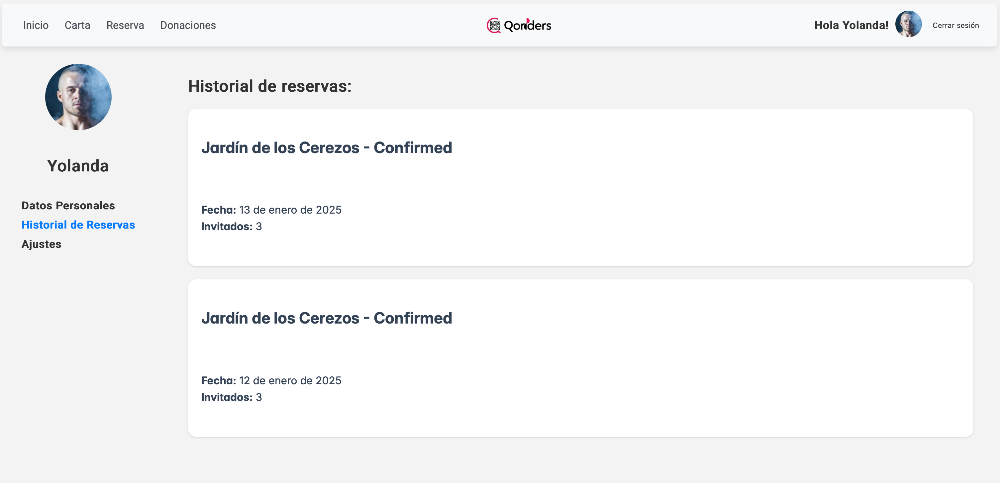

---

### 🧑‍🍳 Dashboard para Camareros
El dashboard simplifica las operaciones diarias del personal del restaurante.

- **Gestión de Reservas**:
  - Visualización de reservas asignadas a la sala del camarero.
  - Acceso a generar y enviar códigos QR para check-in.
  - Visualización de tickets asociados a reservas completadas.

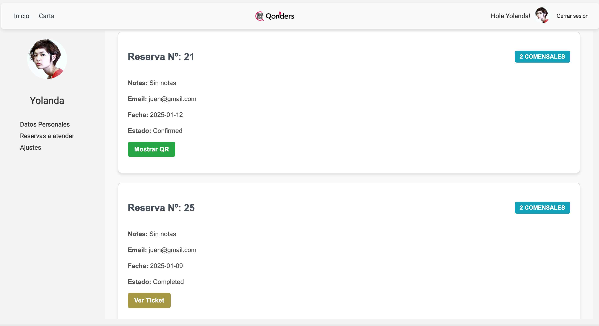

- **Gestión de Comandas**:
  - Visualizar y gestionar los pedidos asociadas a cada reserva.
  - Cambiar estados de los pedidos y detallar productos pedidos.

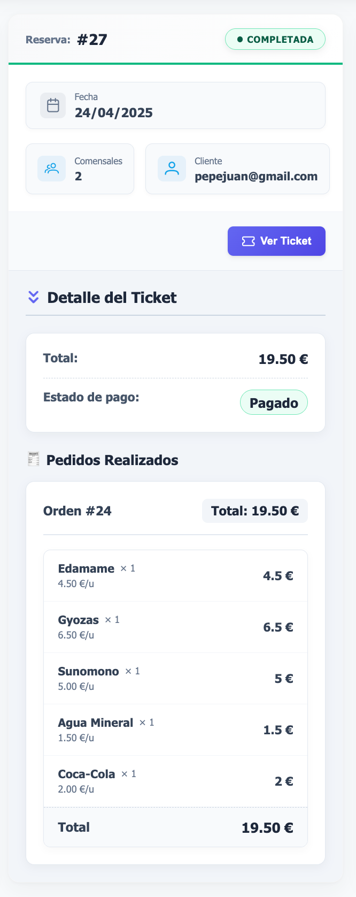

- **Perfil Camarero**:
  - Ver los datos personales.
  - Modificar información de su perfil que no sea relevante al puesto de trabajo.

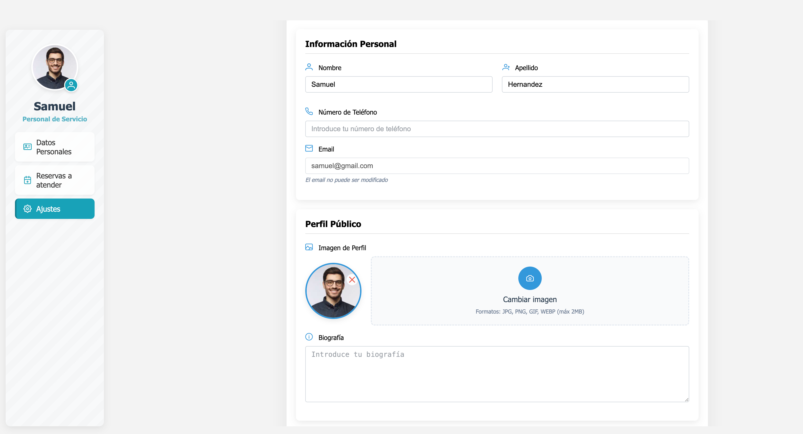

---

### 🧑‍💼 Dashboard para Managers
El dashboard proporciona a los managers una herramienta centralizada para gestionar operaciones clave.

  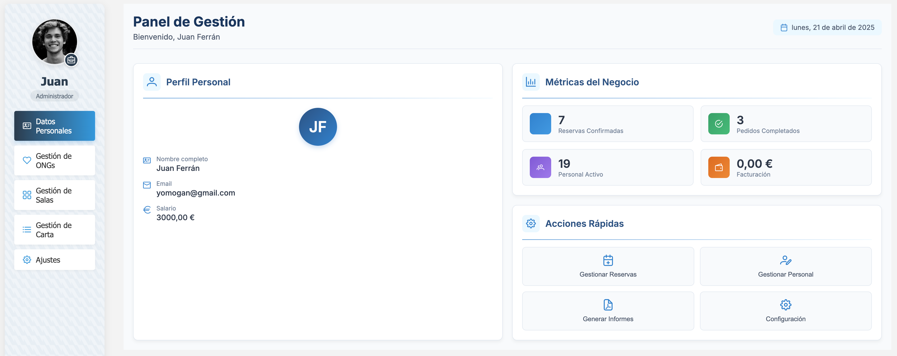

- **Gestión de Salas, ONG y Productos**:
  - Crear, actualizar y habilitar/deshabilitar salas y ONG.
  - Filtro de productos por sala para poder modificarlos.

  
  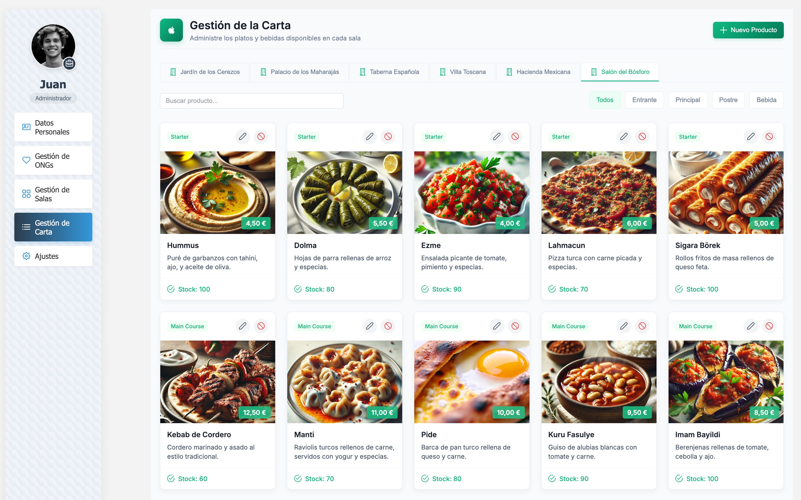
  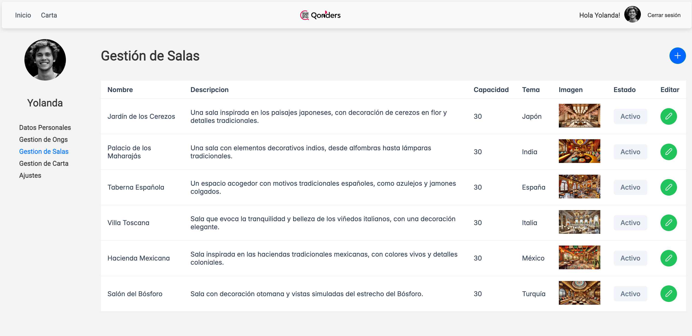

- **Perfil Manager**:
  - Ver los datos personales.
  - Modificar información del perfil.

  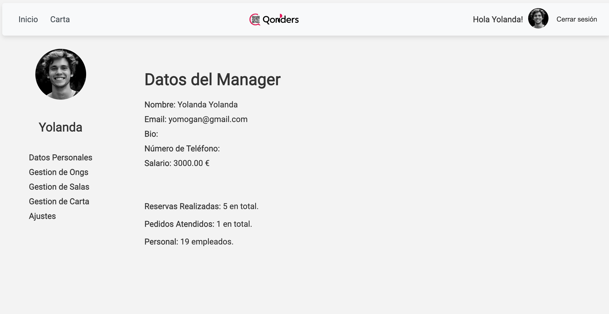

---

### 🔒 Seguridad y Control de Acceso
QoRders prioriza la seguridad y la gestión de accesos:

- **Autenticación con JWT**:
  - Garantiza un acceso seguro a todas las funcionalidades.
  - Manejo de sesiones con tokens y control de expiración.

- **Roles y Permisos**:
  - Control granular basado en roles como `Cliente`, `Manager` y `Camarero`.
  - Middleware asegura que solo usuarios autorizados accedan a funcionalidades específicas.

- **Clave SSL para el dominio**
  - Poder acceder a la web mediante https.

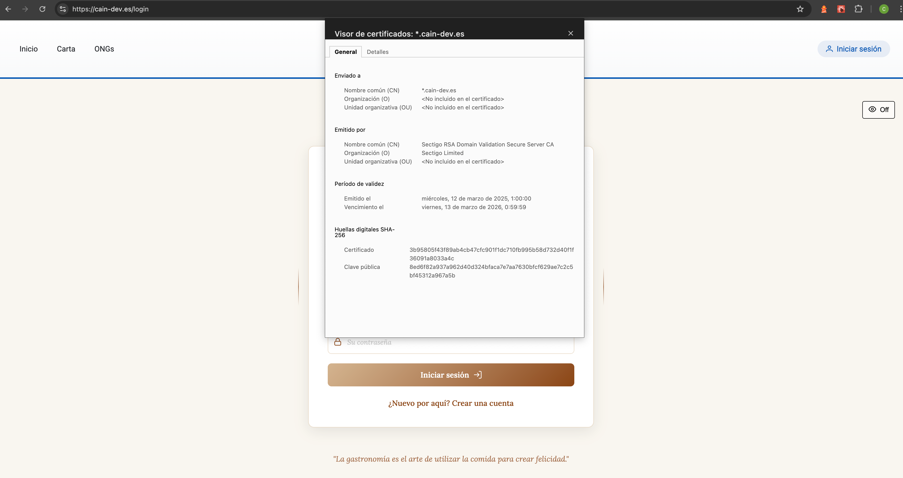

---

### 🌍 Valor Social
En cada venta del restaurante que gestione **QoRders** el 5% del monto total de la cuenta se abonará a una **ONG** asociada al país de origen de la sala temática:

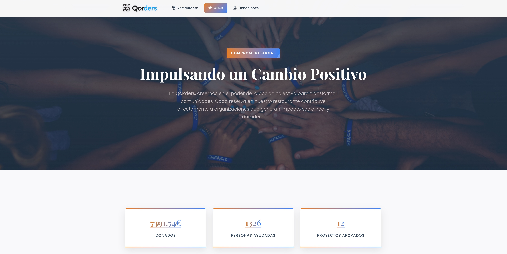

- **Donaciones a ONG**:
  - Visualizar las ONG vinculadas al restaurante.
  
  - Posibilidad de donación a las ONG sin estar registrado.

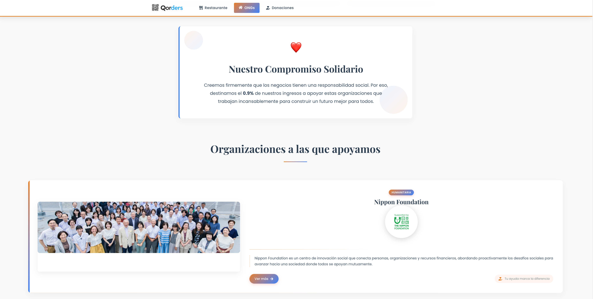

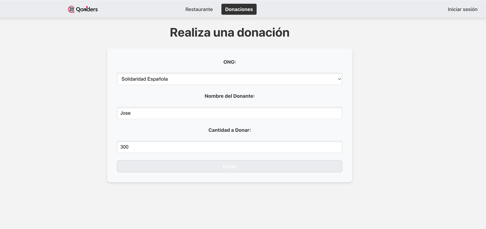

---

## Conclusión
QoRders ofrece una solución robusta y segura para la gestión de restaurantes, mejorando la eficiencia operativa y asegurando una experiencia excepcional para los clientes. Con su diseño modular y extensible, está preparado para crecer e integrarse con nuevas funcionalidades en el futuro ya tengas un restaurante temático o uno tradicional.

---

#### 📜 Licencia
Esta aplicación está licenciada bajo la [Licencia MIT](https://opensource.org/licenses/MIT).
